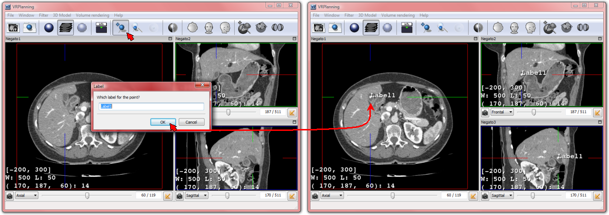
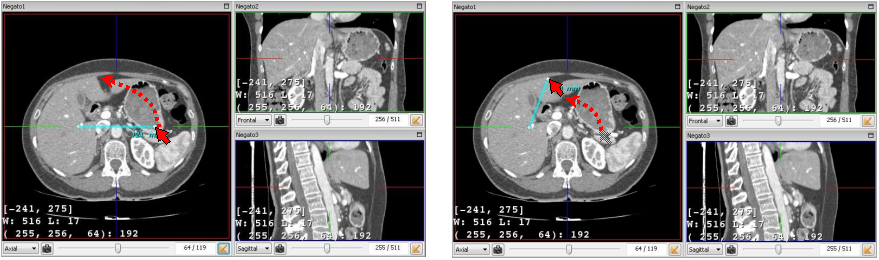

2D MPR Landmarks and Distance Measurement 
=========================================

.. index:: 2D landmark, 2D distance

VR-Planning integrates a 3D landmarks positioning system in order to label a wanted 3D position of a voxel in the medical image. As described in the 3D medical image visualization, the management of these landmarks will be performed thanks to the following  three buttons of the tool bar  :

.. image:: _static/Add-Find-View-landmark.png
   :align: center

Thus, a 3D landmark can be positioned at the last selected voxel position by clicking on the ''Add landmark'' button of the tools bar. This action also open a small window allowing to name the landmark. The landmark then appears and can be moved in (an only in) the selected Negato view by simply selecting it through a mouse left button press, and by moving it in the view by keeping the left button pressed and releasing it in the wanted location. 

All 3D landmark position being recorded, it is possible to automatically reach a landmark position by clicking on the ''Find landmark'' button of the tools bar. The selection of the wanted landmark will then allow to automatically position the three Negatos (axial, frontal and sagittal views) on the 3D position of the landmark. Landmarks taking an important place on the selected view, it is also possible to hide or show all landmarks by using the ''Hide/Show landmarks'' button of the tools bar. Finally, any landmark can be erased by a simple right mouse button click on it.

Distance computation is activated by using the button located in the bottom right part of each Negato. A single click adds a colorized distance segment in the Negato view. Each new click adds such a distance segment with each time a new color. Distances are computed between two 3D spheres that can be moved in the Negato by simply selecting it by pressing on the mouse left button, and by moving it in the view by keeping the left button pressed and releasing it in the wanted location. Distances are computed in 3D. It is thus possible to position the two spheres on two different slices (slice selection being performed thanks to the slider). In order to simplify such positioning, the distance segment always appears in the Negato. The sphere representation then allows to know if the sphere is on (normal grey sphere), under (no sphere) or above (grey sphere surrounded by a yellow disk) the visualized slice. Each distance segment can be removed by a simple right button click on one of its two distance spheres. Another way to remove distance segments consists in using the option ''Remove distance'' in the ''Window'' menu. It is finally possible to hide distance spheres by using the option ''Hide distance'' in the ''Window'' menu.

