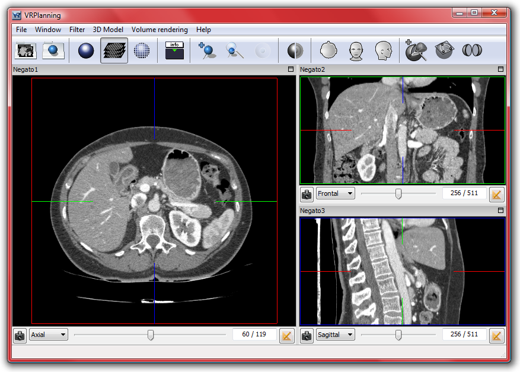
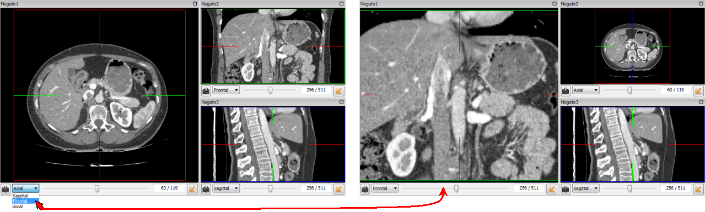
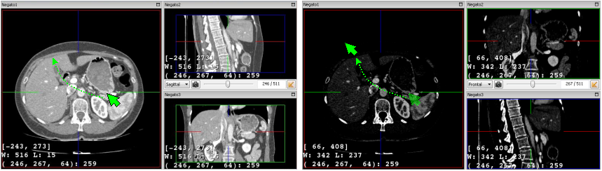
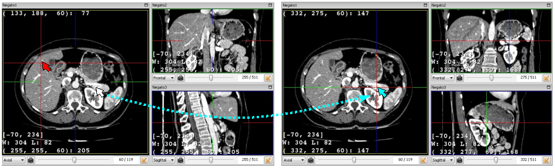
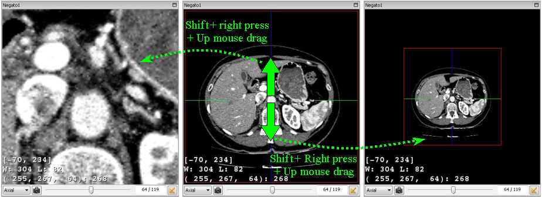
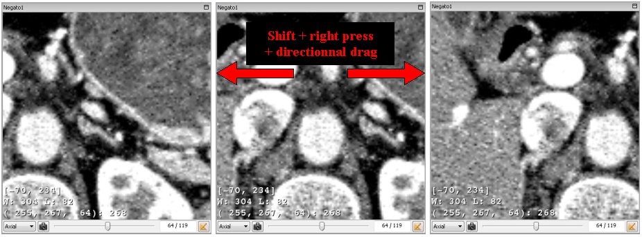

2D Medical Image Multi-Planar Rendering (MPR)
=============================================

.. index:: 2D MPR, Multi Planar Rendering 

The 2D medical image visualization is selected by using the F2 shortcut or the forth icon of the tool bar :

.. image:: _static/icon-2D.png
   :align: center

The Multi-Planar Rendering (MPR) corresponds to the most standard visualization techniques developed and used on professional medical imaging workstations : three different views of the medical image in Axial, Frontal and Sagittal views. Each window is called Negato. VR-Planning provides such a 2D medical image view in one big left window (Negato1) and two smaller right windows (Negato2 and Negato 3).

It is easy to change the visualized axis of the Negato by using the axis selection menu at the left bottom part of each Negato. The visualized axes are automatically synchronized in order to keep the three Axial, Frontal and Sagittal views in three different windows. 

Each Negato indicates the minimum and maximum screened density [min,max], the standard density windowing size W and the middle density of the windowing L. As in the 3D medical image visualization, it is possible to improve the visualized grey-level by modifying the screened windowing. The parameterization of the visualized grey level window is done via the same technique as developed in all existing radiological software tools. When pressing the right mouse button in the image, it is possible to decrease or increase the center of the grey level window and the grey level window size with up (decrease) or down (increase) and left (decrease) or right (increase) movements of the mouse. 

Each Negato indicates the last selected voxel (voxel = volumic pixel), the coordinates (x,y,z) and the density of this voxel being indicated on the last line. Such a selection is performed by a simple left click in the image. Pressing (or clicking) the middle button provides the same information but adds an automatic synchronization of all views. When pressing the button, a full red cross centered on the selected voxel appears on all views while pressing the button.

It is also possible to zoom and to translate the image on each Negato in order to focus the attention on a part of the image. After a left click in the selected Negato, you can zoom with the mouse wheel or by using the combination of the ``Shift`` key and pressing the right button of the mouse. A movement from bottom to top increases the zoom, and a movement from top to bottom decreases the zoom. 

The translation is performed by using the combination of the ``shift`` key and pressing the left button of the mouse. In this case, a movement in any direction creates a translation in the same direction. The reset of translations and zooms is performed with the ``R`` key.

The snapshot tool located at the left bottom part of each Negato allows to save the 2D-Slicer view in jpeg format. The snapshot is activated by a simple left button click on the picture icon localized at the bottom part of the window.

