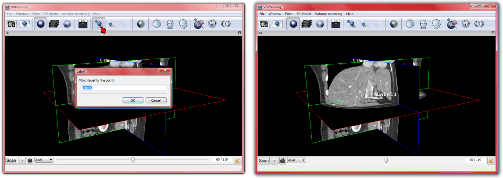
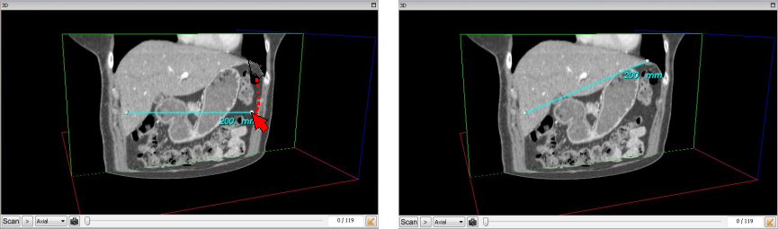

3D Landmarks and Distance Measurement
=====================================

.. index:: 3D landmarks, 3D distance

In order to label a wanted 3D position of a voxel in the medical image, VR-Planning integrates a 3D landmarks positioning system. The management of these landmarks will be performed thanks to the following three buttons of the tool bar corresponding respectively to ``Add landmark``, ``Find landmark`` and ``Hide/Show landmarks`` :

A 3D landmark can be positioned at the last selected voxel position by clicking on the ``Add landmark`` button of the tools bar. This action also open a small window allowing to name the landmark. The landmark then appears and can be moved in the Negato view by simply selecting it through a mouse left button press, and by moving it in the view by keeping the left button pressed and releasing it in the wanted location.

All 3D landmark position being recorded, it is possible to automatically reach a landmark position by clicking on the ``Find landmark`` button of the tools bar. The selection of the wanted landmark will then allow to automatically position the three axial, frontal and sagittal planes on the 3D position of the landmark. 3D landmark taking an important place on the view, it is also possible to hide or show all landmarks by using the ``Hide/Show landmarks`` button of the tools bar. Finally, any landmark can be erased by a simple right mouse button click on it.   
   
VR-Planning also offers the possibility to compute distances in 3D view. Distance computation is activated by using the distance button located in the bottom right part of the view. A single click adds a colorized distance segment in the medical image view. Each new click adds such a distance segment with each time a new color. Distances are computed between two 3D spheres that can be moved in the medical image view by simply selecting it through a mouse left button press, and by moving it in the view by keeping the left button pressed and releasing it in the wanted location.

