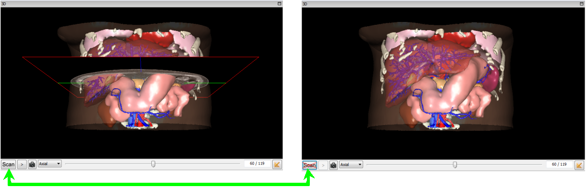
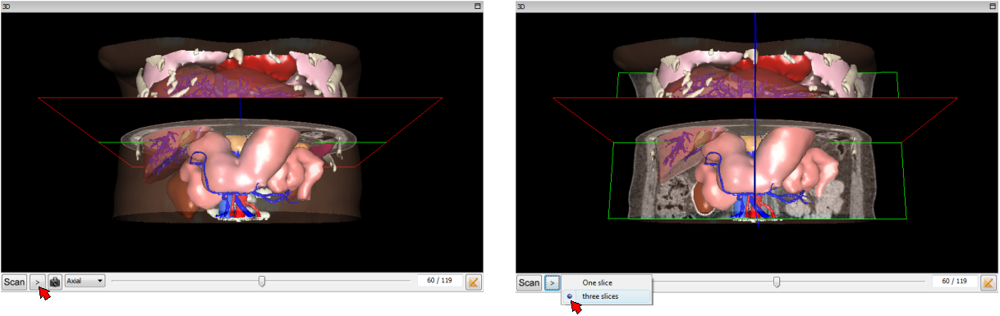
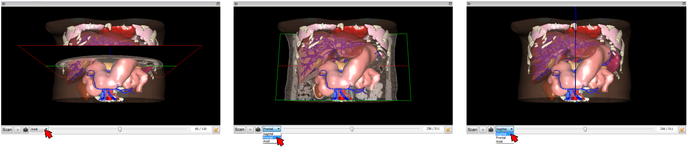
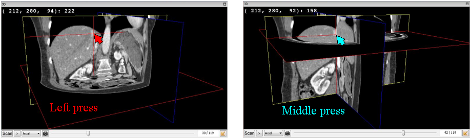
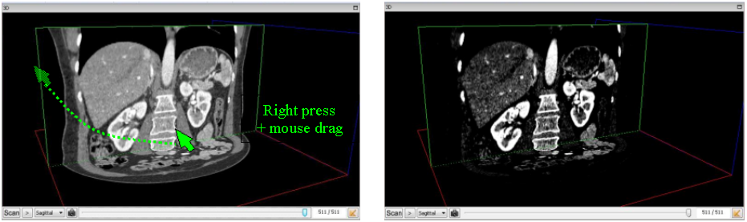

3D Medical Image Visualization (including oblique plane)
========================================================

.. index:: 3D medical image, oblique plane 

VR-Planning allows to visualize the medical image in a 3D rendering of slices. This rendering is automatically activated when the patient is loaded. However, it is possible to hide this medical image visualization by a simple click on the ``Scan`` button located on the left bottom of the 3D window. A new click on the ``No scan`` button allows to show again the medical image. 

When the medical image is visible, two different modes of visualization are available. The default one slice view can thus be replaced by using the ``>`` button located in the bottom left part of the 3D window. The user can select and display three planes corresponding to the axial, frontal and sagittal view. 

The default one slice view is an axial view. The bottom view selector allows to replace this axial view by a frontal or a sagittal view. The slice selection is then performed thanks to the slider located to the bottom part of the visualization window. 

Finally in all mode, the medical image visualization can be modified by using the same interaction than in the 2D visualization. First of all, it is possible to select a voxel of the image and to obtain its coordinates (x,y,z) and its density through a simple left click (or press) in the medical image. These information are printed in the top left part of the window. The same information are obtained with a middle click that automatically synchronizes axial, frontal and sagittal view on the selected voxel. 
  

The parameterization of the visualized grey level window is done via the same technique as developed in all existing radiological software tools. When pressing the right mouse button in the image, it is possible to decrease or increase the middle value of the grey level window with up (increase) or down (decrease) movements of the mouse and the grey level window size with left (decrease) or right (increase) movements of the mouse. 
  

   
   
