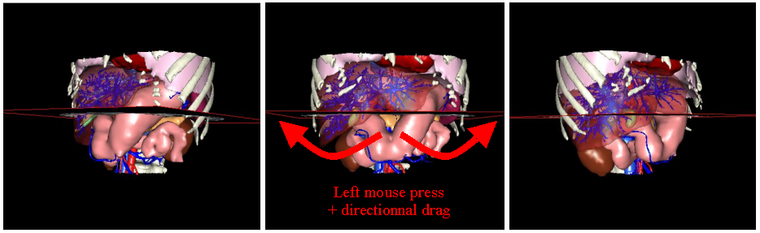
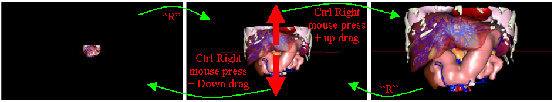
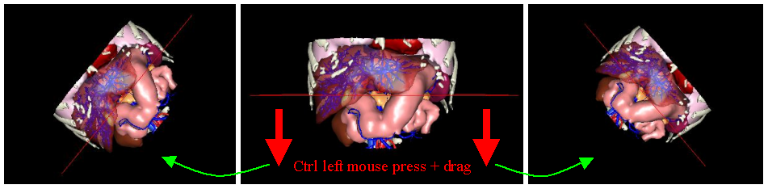

3D Models Manipulation
======================

.. index:: 3D Models, 3D Visualisation

The 3D model manipulations mode is automatically selected when you start VR-Planning. It is also possible to select this mode by using the F1 shortcut or the third icon of the tool bar  :

.. image:: _static/icon-3D.png
   :align: center

The tool bar contains three recorded 3D views : axial, frontal and sagittal. These three views are activated by selecting the ``Axial view``, ``Frontal view`` and ``Sagittal view`` options in the  ``3D Model`` menu, or by a simple click on the three last buttons of the tool bar : 

================================= =================================== ==================================== 
.. image:: _static/icon-axial.png .. image:: _static/icon-frontal.png .. image:: _static/icon-sagittal.png
================================= =================================== ==================================== 
.. image:: _static/axial-view.jpg .. image:: _static/frontal-view.jpg .. image:: _static/sagittal-view.jpg
================================= =================================== ==================================== 

The 3D modeled patient can be moved through different interactions on the 3D image. Here is the list of these interactions :

- Rotation around the center of the 3D view by a left mouse button press and a mouse dragging in direction of the rotation. 

- Translation by a shift + left mouse button press and a mouse dragging in direction of the translation. The translation can be reset by pressing the ``R`` key on the computer keyboard (reinitialisation of the point of view)

.. image:: _static/3D-translation.png
   :align: center

- Zoom by a Shift + right mouse button press and a mouse dragging up (zoom in) or down (zoom out). The same result is obtained only with the right button press (out of the 3D Scan), or by using Ctrl + right mouse button. The Zoom can be reset by pressing the ``R`` key on the computer keyboard (reinitialisation of the point of view).

- Rotation around the central axe of the 3D view by a Ctrl + left mouse button press and a mouse dragging in direction of the rotation.

At any time, the user can take a jpeg picture of the 3D view by clicking on the picture icons at the bottom part of the windows.

