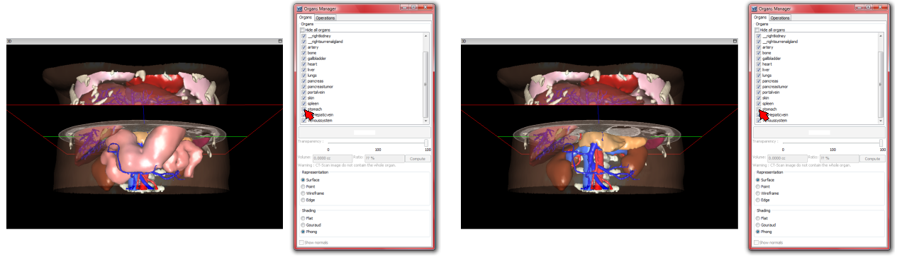
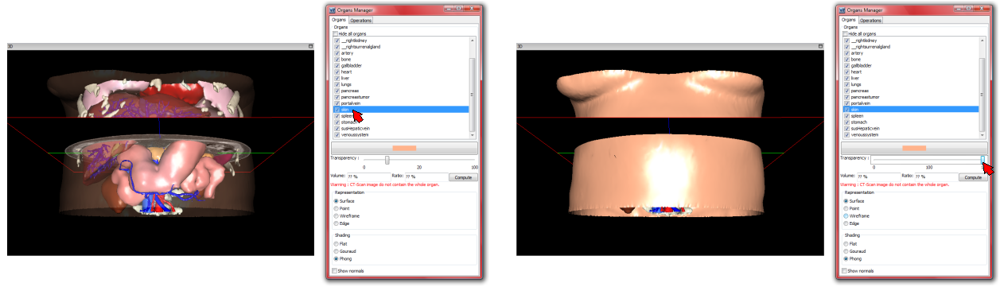

3D Models Properties (show/hide organs)
=======================================

.. index:: Models Properties, Show organs, Hide organs

The list of 3D modeled organs is available in the ``Organ Manager`` window that appears by selecting the ``Manage organs colors`` option in the ``3D Model`` menu, or by pressing F9 on the keyboard, or by clicking on the following button of the tool bar  :

.. image:: _static/icone-F9.png
   :align: center

The ``Organ Manager`` window allows to display or hide any organ by using the check box. The ``Hide all organs`` check box allows to hide all organs.

It also allows to modify its opacity thanks to a slider located at the bottom part of the property window.

