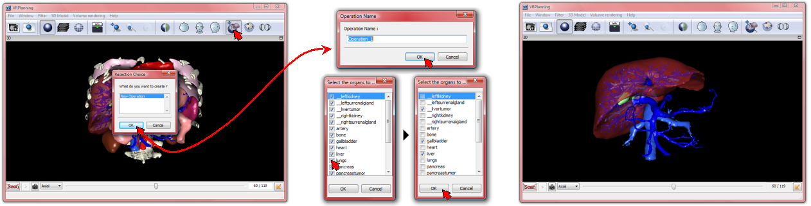
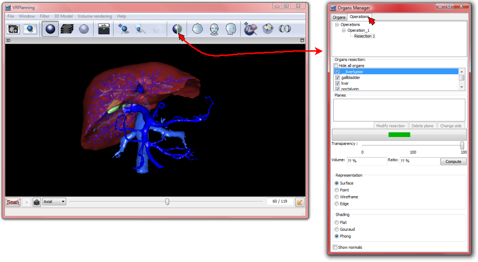
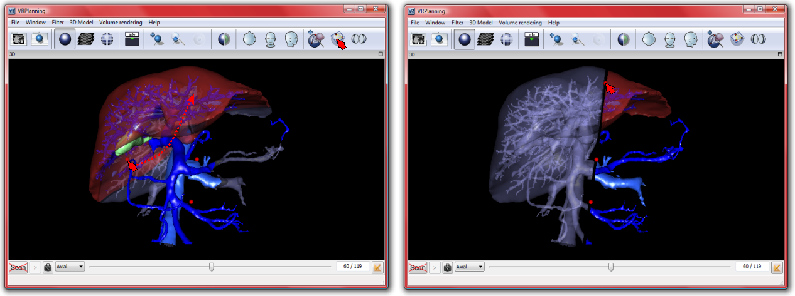
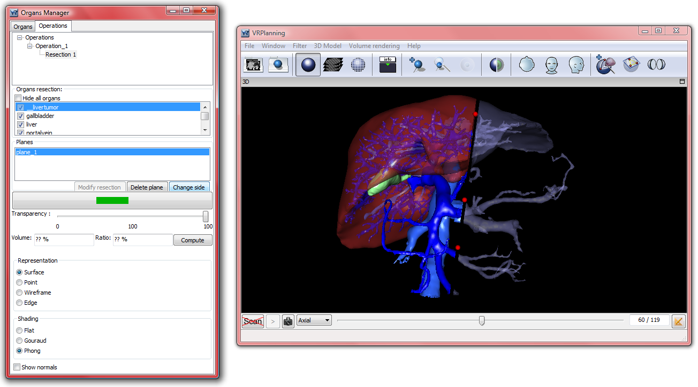
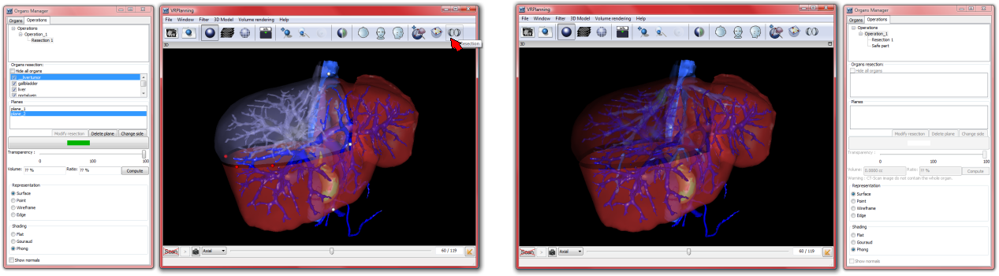
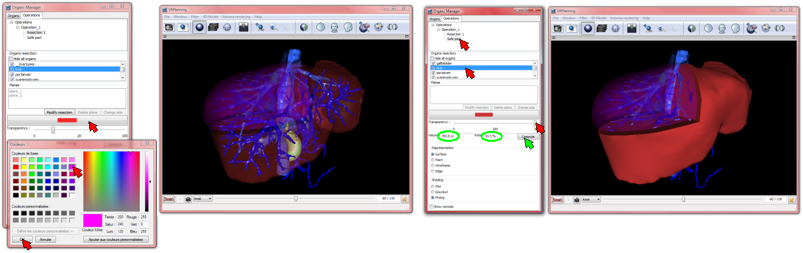
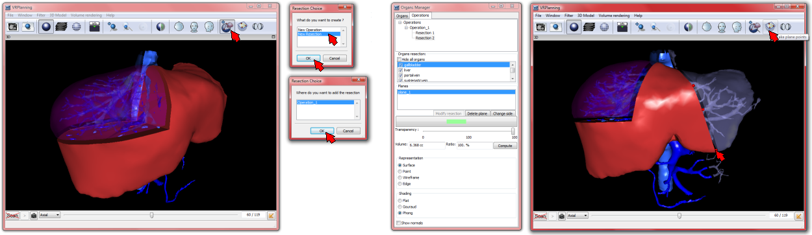

VR-Planning Resection
=====================

.. index:: Resection, cutting plane

VR-Planning allows to virtually resect any anatomical or pathological 3D modelled structure and to obtain the resulting volume and linked percentage of resection. VR-Planning not only gives the opportunity to perform several resections but also to plan several surgeries. The first step will thus consist in defining the operation by clicking on the ``New Resection`` button of the tool bar. 

Clicking on the ``New Resection`` button opens a window that proposes to create a new operation if no operation has been planned before. By clicking on OK, you can give an operation name (Operation_n by default). The validation with a click on the OK button then opens a new window containing the list of organs that will be possible to cut. By default, all visible organs are selected. After the selection of organs, a click on the OK button validates the operation definition and only organs that can be resected appear in the 3D rendering window.

At this stage of the operation definition it is possible to add a cutting plane by using the ``Take plane points`` button.

   
At any time, it is also possible to see the operation parameterisation by opening the ``Organ Manager`` window by a click on the organ manager button of the tool bar and by selecting the ``Operations`` tab in the window. The Organ Manager window offers the opportunity to modify selected organ properties. As we will see, it will also allow to modify cutting plane parameterization.

   
The resection requires the definition of one or several cutting planes. A cutting plane can be added by using the ``Take plane points`` button on the tool bar. After a click on this button, a cutting planes appears in the 3D view. The blue part will be the resecting part and the normal coloured part will be the safe part. Any cutting plane can be moved by selecting the three red control points (red square box). All control points can be selected and moved by a left button hold and mouse displacement. 

 
Any cutting plane separates the space into two areas: the resecting area and the safe area. It is possible to switch both areas by using the Organ Manager window. You must first select the wanted plane and then click on the ``change side`` tab to switch the resected area with the safe area as shown on the following image.

 
VR-Planning allows to add several cutting planes for each operation. At any time a simple click on the ``Take plane points`` button of the tool bar is sufficient to add and then displace the new cutting plane that will appear in the Organ Manager window in the ``Plane`` area of the ``Operation`` tab. A resection is then finalized by a simple click on the ``Resection`` button of the tool bar.

 
After each resection, the ``Operation`` tab of the Organ Manager window indicates the resected part and the safe part list of organs. It is possible to change the rendering properties (colour and transparency) of each resected or safe part of organs. It is also possible to obtain the volume and percentage of both the safe and the resected part by selecting the wanted organs. Information appears then in the dedicated volume and ratio area of this window after a click on the ``Compute`` button.

   
One of the great improvements of VR-Planning in comparison with 3D VSP, which had been developed by IRCAD in 2001, is the opportunity to realize several resections on a same organ. It allows for instance to realize several segmentectomies on a same liver. To add a new resection, the user has to click on the ``New Resection`` button. It will then propose to choose between adding a new operation or adding a new resection. By selecting and validating a ``new resection``, a new window will appears in order to choose which operation this new resection will be applied to. After selection, the resection can be defined with one or several cutting planes with the same method explained for the first resection.

   
The user can also choose to do a new operation, replacing the previously performed operation. To add a new resection, the user has to click on the ``New Resection`` button. It will then propose to choose between adding a new operation or adding a new resection. By selecting and validating a ``new operation``, a new window will appear allowing to change the name of the operation (by default operation_N). All interactions are then the same as for the first operation.

Finally, you can change a resection or an operation by using the ``Operation`` tab of the ``Organ Manager`` window. The user has first to select the requested operation in the operation list. He/She will then be able to change a resection by adding or removing cutting planes. He/She must thus select the wanted resection in the same list and click on the ``Modify resection`` button. He/She will then be able to modify the cutting plane position, to add a cutting plane with the ``Take plane points`` button, to remove a plane with the ``Delete plane`` button and to change the side of the cutting area with the ``Change side`` button.
