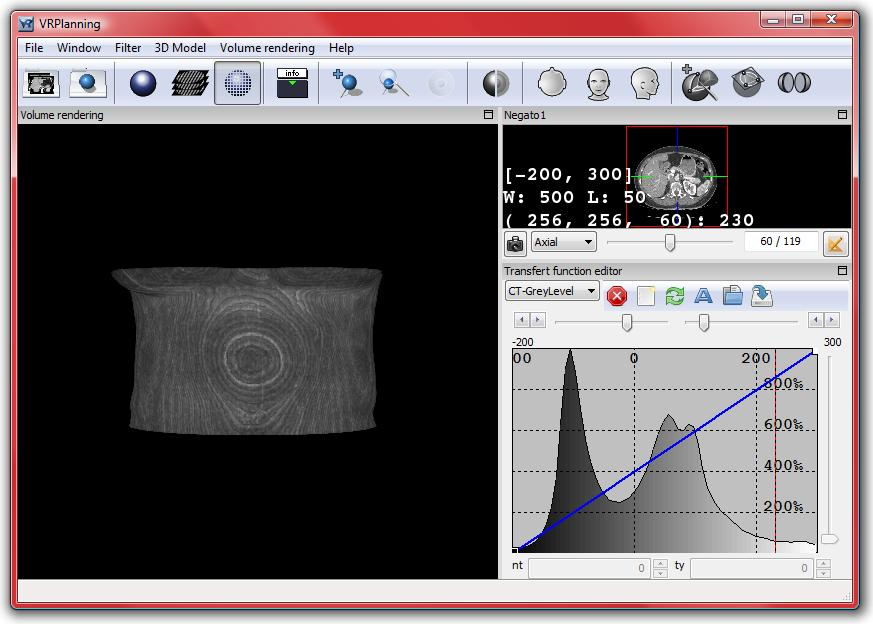
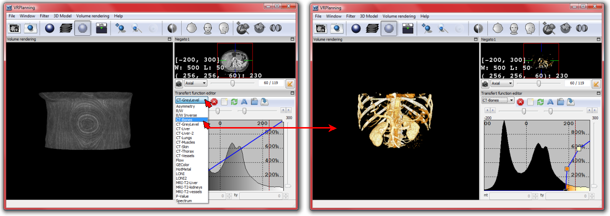
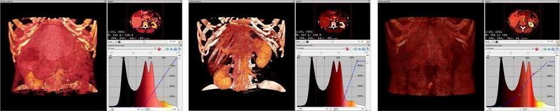
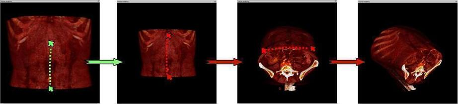
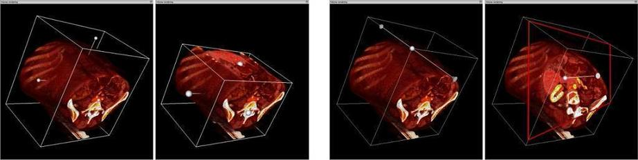

3D Volume Rendering
===================

.. index:: 3D Volume Rendering

The VR-Planning visualization mode is started by pressing the F3 shortcut. It is also possible to select this mode by clicking on the VR icon of the tool bar : 

VR-Planning has been developed in order to be used in a fast way. Automated transfer functions (TF) have therefore been included in the software allowing users to save time by only selecting these transfer functions. This selection is performed in the TF selector box of the ``Transfer function editor``.  

As shown for medical use, the current software includes several pre-computed CT-scan transfer functions allowing to visualize bones, kidneys, liver, lungs, muscles, skin and vessels. More automated transfer functions provide standard transfer functions currently used in other applications. It is important to notice that in VR-Planning the color table of the transfer functions is applied on the Negato1 view. It can be highly useful to have a better medical image reading. 

It is possible to manipulate the Volume Rendering view with the same command than with the 2D MPR view, which means by using the mouse wheel or by using the combination of the ``Shift`` key and pressing the Right button for the zoom, by pressing the Left button and moving the mouse for the rotation, and by combining the ``Shift`` key and pressing the Left button for translation. In this case, a movement in any direction creates a translation in the same direction. The reset of translations and zooms is performed with the ``R`` key.

It is also possible to go directly to axial, frontal, and sagittal views by using the shortcut ``1``, ``2`` and ``3`` on the keyboard or the ``Volume Rendering`` menu by selecting ``Axial view``, ``Frontal view`` and ``Sagittal view`` options. In this same menu, the ``Snapshot rendering view`` option allows to take a picture of the Volume rendering view.

Another important interest of VR-Planning is the ability to visualize only a part of the image by applying a cutting plane on the global image. Two major kinds of cutting planes are proposed. The first one is the standard axial, sagittal and frontal cutting plane. The second one is a mobile 3D cutting plane that can be placed anywhere in the volume. The selection of cutting planes (and unselection) is done with the ``Volume Rendering`` menu or via shortcuts : ``O`` for the ``View clipping Box`` option providing three main axes and ``P`` for ``View clipping Plane``. 

The clipping box provides 6 cutting planes: two axial, two frontal and two sagittal ones. The displacement of a cutting plane is then performed by pressing the left mouse button on the corresponding center sphere of this plane. When selected, the plane changes color and the sphere turns red. Displacement is then realized by moving the mouse. It is possible to remove the clipping box planes by selecting the ``Reset clipping box`` option in the ``Volume Rendering`` menu or by using the shortcut ``Ctrl O``.

This cutting box can also be reduced through a kind of in and out zoom by selecting the central volume sphere by a right button pressing, and then by adding a ``Shift`` pressing and an up (zoom out) and down (zoom in) movement of the mouse. In the same way, the cutting box can be translated by selecting the central volume sphere by pressing the left button, and then by adding a ``Shift`` pressing and a movement of the mouse.

Furthermore, the clipping plane provides one cutting plane that can be moved thanks to the displacement and orientation of a vector that is normal in this cutting plane. The displacement is then performed by pressing the left mouse button on one of the two extremities of the vector. When selected, the vector turns red. Displacement is then realized by moving the mouse. When the cutting plane cuts the box, a red intersection appears. It is then possible to directly move the plane into the direction of the normal vector by pressing the left mouse button on one of its borders and by displacing it. It is finally possible to remove the clipping box planes by selecting the ``Reset clipping plane`` option in the ``Volume Rendering`` menu or by using the shortcut ``Ctrl P``.
