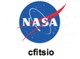
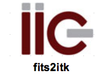
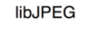
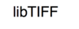
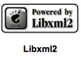
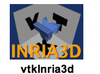
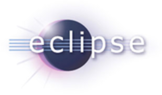
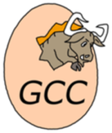

.. _acknowledgment:

Acknowledgment
==============

.. index:: Acknowledgment, open source, European, ICT, ehealth

.. |EQC| replace:: European Commission
.. _EQC: http://ec.europa.eu/information_society/activities/health

.. _PASSPORT: http://www.passport-liver.eu/

.. |dcmtk|      image:: _static/acknowledgment/dcmtk.png
                :align: middle

.. |opengl|     image:: _static/acknowledgment/opengl.png
                :align: middle

First of all, VR-Planning has partly been funded by the |EQC|_ within the ICT-2007.5.3 research project PASSPORT_.

VR-Planning  has been developed by Vincent Agnus, Arnaud Charnoz, Emilie Harquel, Alexandre Hostettler, Pascal Monnier, Johan Moreau, Nicolas Philipps and Julien Waechter, the project being managed by Prof. Luc Soler. Illustrations and logos have been realized by Juan Hernandez. Documentation and translation has been realized by Pamela Lhote and Luc Soler.

The test and validation session has been performed by Mourad Bouhadjar, Anne-Blandine Osswald, and Prof. Luc Soler. 3D gallery and patient modeling have been realized by Mourad Bouhadjar, Anne-Blandine Osswald and Prof. Luc Soler.

The website development has been supervised by the Websurg team under the management of Thomas Parent.

This sofware has been tested at the University Hospital of Strasbourg. We would like to thank for their help the medical staff: 
- Endocrine and Digestive Surgical team : Prof. Jacques Marescaux, Prof. Didier Mutter, Prof. Bernard Dallemagne, Prof. Luc Soler, Dr. Michel Vix,

VR-Planning has been built on the following projects :

.. list-table::

   * - |boost|
     - |cfitsio|
     - |dcmtk|
     - |fits2itk|
     - |itk|
     - |vtk|
     - |vtkinria3d|
   * - |libjpeg|
     - |libpng|
     - |libtiff|
     - |libxml2|
     - |log4cxx|
     - |opengl|
     - |wx|
   * -
     - |python|
     - |sphinx|
     - |zlib|
     - |bzip2|
     - |gdcm|
     -

VR-Planning has been developed with the following software :

.. list-table::

   * - |doxygen|
     - |eclipse|
     - |vim|
     - |fsf|
   * - |gcc|
     - |scons|
     - |wix|
     - |visualc|

