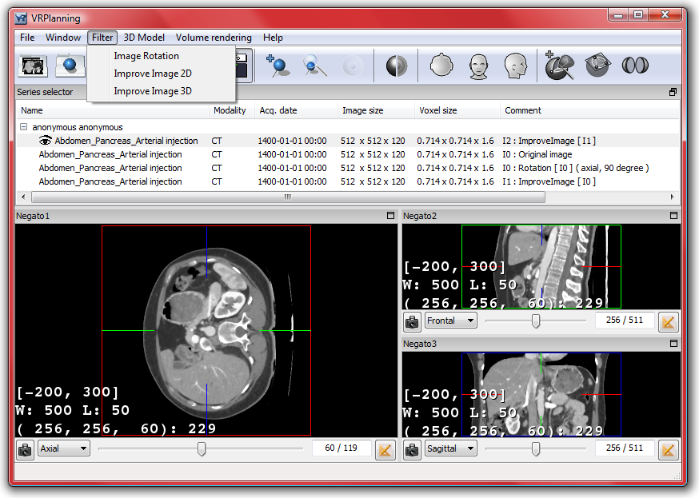

VR-Planning basic image filtering
===================================

.. index:: filtering

Several filters have been added in VR-Planning allowing to basically modify a selected image. When a filter is applied, a copy of the selected image is created and added in the ``series selector``. To distinguish the resulting image from the native image, the selector indicates a set of information allowing to precisely know the origin of the image and the parameter of the filter that has been used. This information is located in the comment area and is presented as follows: In : Operator [Iorigin] (parameters of the operator), where n is an automatic incremental value from 1, In the nth images resulting from filtering application and [Iorigin], the image on which the Operator is applied. 

In VR-Planning, we have decided to limit the set of filters to three basic operators: Image Rotation (that allows a +/- 90 degrees rotation in axial, saggital or frontal axe), Improve image 2D (a 1 pixel radius 2D median filter), and Improve image 3D (a 1 voxel radius 3D median filter).

