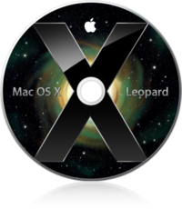

Minimal Configuration
=====================

.. index:: Minimal Configuration, OS

VR-Planning supports the following operating systems :

.. |ms|         image:: _static/acknowledgment/ms.png
                :align: middle

.. list-table::

   * - |ms|        
..   - |apple|     
..   - |linux|     
..   - |linux-64|  

.. To works, VR-Planning requires a minimum of 2 Go (Mac OS, Linux, windows NT) or 3 Go (Vista/7) of RAM. The 3D rendering requires a 3D graphics card working under OpenGL.

To works, VR-Planning requires a minimum of 2 Go (windows XP) or 3 Go (Vista/7) of RAM. The 3D rendering requires a 3D graphics card supporting OpenGL.

