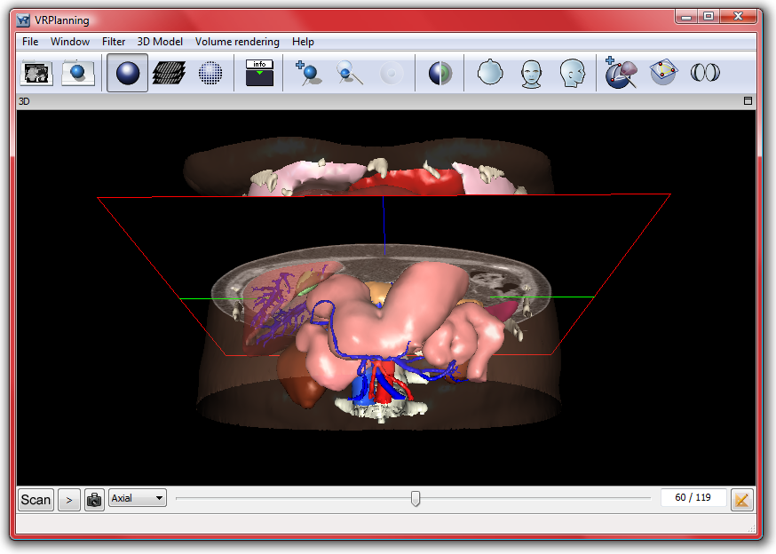

Start VR-Planning
===================

.. index:: Start

VR-Planning has been optimized for surgeon use. After installation, it will thus automatically recognize the IRCAD file format. By selecting the 3D clinical case (some 3D cases are freely available on www.websurg.com), VR-Planning will automatically start. However, you can also start VR-Planning for your own DICOM data or to select several IRCAD 3D modeled patients. IRCAD 3D modeled data are recognized and appear with the following VR-Planning icon :

When VR-Planning is started by selecting a patient, the 3D model visualization window appears as shown on the following example.

