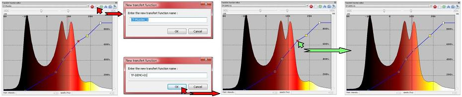
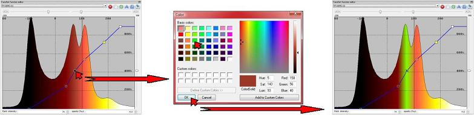
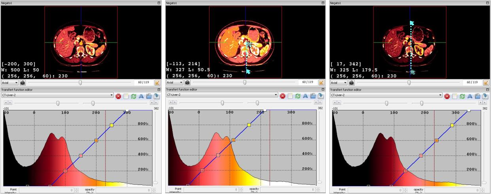
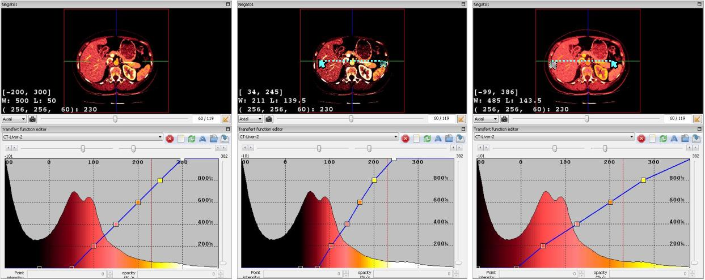

Transfer Function Editor
========================

.. index:: Transfer Function, TF Editor

VR-Planning has been developed in order to edit transfer functions. Seven buttons are thus available :
- The ``Delete`` button (red cross) removes a selected transfer function in the list,
- The ``New`` button (white paper) defines a new transfer function in the list,
- The ``Reinitialize`` button (green arrow) reinitializes the native transfer functions,
- The ``Rename`` button (A) allows to change the name of a selected transfer function. 
- The ``load`` (folder) and ``save`` (bleu arrow) buttons allow to load or save a transfer function in a selected location on the hard drive or on the network. 

When a new function is created, this function is set by default with the same parameter as the last selected one. It is possible and easy to change any transfer function (new or old) by using the transfer function editor. All TF are set by control points that can be removed by a simple right button click on the selected control point in the transfer function.

Addition of a new control point is done by pressing the control keyboard button and by clicking on the left mouse button on the transfer function. It is also possible to change the color of any control point by a double left button click on it. It then opens a color tab allowing to select the new requested color. The transparency and grey level of each control point can be modified by moving it by pressing the left mouse button and displacing it. These values can also be modified more precisely by indicating the precise requested value in the button part of the transfer function editor windows.

It is finally possible to easily modify the transfert function by using the windowing parameterization techniques. This method allow to fastly adapt the pre-computed CT-scan transfer functions to the specificity of the selected image. It is thus possible to make a translation of the Transfert function in order to reduce the grey level value (Mouse Right button Pression and displacement from up to down), or in opposite in order to increase the grey level value (Mouse Right button Pression and displacement from down to up) (see next image).

It is also possible to make a resizing of the Transfert function in order to reduce the grey level window (Mouse Right button Pression and displacement from right to left), or in opposite in order to increase the grey level window (Mouse Right button Pression and displacement from left to right) (see next image).

