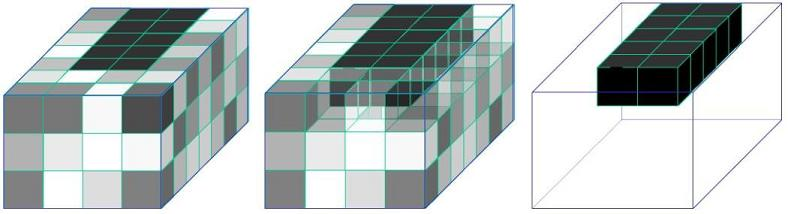
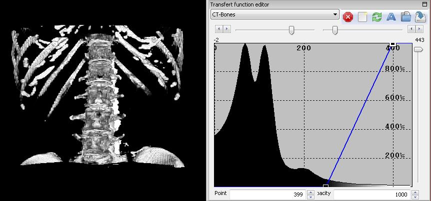

What is direct Volume Rendering ? 
=================================

.. index:: Volume Rendering 

Volume Rendering (VR) is a well known visualization method for the 3D visualization of medical images. It is based on transparency and coloration of voxels. Indeed, a medical image is composed of a set of voxels, each voxel having a grey level that represents a physical property of the tissue (absorption of X ray in case of CT for instance). A voxel being a pixel in 3D, it is a square if slice thickness = pixel size or a rectangular box if slice thickness is different from the pixel size, which represent most clinical images of the thoracic-abdominal area (the most frequent voxel size being typically around 0.5 x 0.5 x 5 mm3, 0.5 x 0.5 x 2 mm3 or 0.5 x 0.5 x 1 mm3). Without transparency and without color, the 3D view of voxels permits to see only border voxels. To see inside voxels, it is therefore necessary to put border voxels in transparency as shown on the following image. 

The remaining problem is thus to select voxels that we want to see, and voxels that have to be put in transparency. Such a selection, called ``segmentation`` in computer sciences and consisting in delineating anatomical or pathological structures, is complex and time consuming. Another solution is to automatically replace all grey levels by colors, and add for each grey level an associated transparency level. This transformation is summarized in a transfer function that gives for each grey level a color and a transparency level. For instance, bones being the highest grey level in a CT, it is sufficient to put all voxels with a grey level under 230HU in full transparency, to put all voxels with a grey level beyond 400 HU with no transparency and to perform a progressive decrease of transparency between these two grey level values. We can do the same with the color map from dark to white. We obtain thus the result illustrated on the following image. In this figure, the transfer function is illustrated on the right. It is printed on the grey level histogram that provides the number of voxels having this grey level for each grey level of the image.

